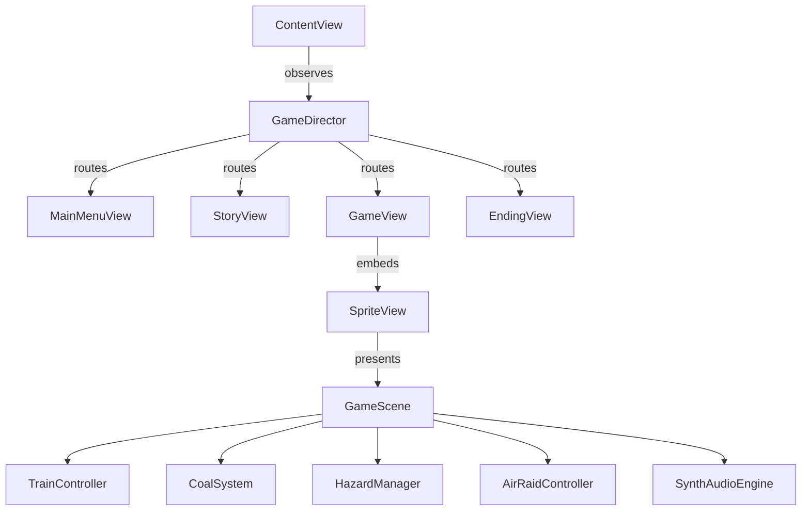

# Implementation Plan — Last Train East

This plan outlines the design and step-by-step implementation of **Last Train East**, a narrative arcade game set during the German invasion of Poland in 1939. Built using **Swift, SwiftUI, and SpriteKit**, it will run on macOS and feature a pseudo-3D first-person perspective, resource management (coal), reaction hazards (broken rails, air raids), and a secret narrative twist.

---

## Architectural Overview

The game leverages SwiftUI for high-level state routing, menus, narrative screens, and credits. SpriteKit runs the interactive core gameplay, physics (for contact/collision checks), perspective rendering, and camera effects.



### Components

1. **State Machine (`GameDirector`)**: Shared `@Observable` state manager coordinates screen switches, active level configuration, and communicates state changes between SwiftUI and SpriteKit.
2. **Audio Engine (`SynthAudioEngine`)**: Synthesizes interactive audio in real time using `AVAudioEngine` (rumble, sirens, furnace flame, explosion, dreamlike drone chords). This avoids dependencies on external files and provides dynamic gameplay soundscapes.
3. **Gameplay Scene (`GameScene`)**: Renders the pseudo-3D parallax background, converging tracks, moving ties (sleepers), cabin dashboard (furnace door, gauges), and handles input propagation.
4. **Train Controller (`TrainController`)**: Governs the visual position of the cabin overlay, lane transitions, speed, and distance calculations.
5. **Coal System (`CoalSystem`)**: Tracks coal capacity, consumes fuel over time, and triggers adding fuel when the Space key is pressed.
6. **Hazard Manager (`HazardManager`)**: Controls spawning of broken rails which start tiny at the horizon and scale up as they slide down the rails towards the train.
7. **Air Raid Controller (`AirRaidController`)**: Manages the sirens, Luftwaffe airplane dive animations, bombs, and downward dodge timing.

---

## Proposed Changes

We will introduce a clean, structured directory structure under the main `Konin` folder. Since the target uses `PBXFileSystemSynchronizedRootGroup`, all created files are automatically included in the Xcode build.

### Models & State Management

#### [NEW] [GameState.swift](file:///Users/dimasps32/Developer/gamejam/Konin/Konin/Models/GameState.swift)
Defines the high-level states: menu, story intro/outros, gameplay, ending, and credits.

#### [NEW] [Chapter.swift](file:///Users/dimasps32/Developer/gamejam/Konin/Konin/Models/Chapter.swift)
Configuration metadata for each gameplay section:
- **Krotoszyn**: Hopeful tone, basic speed, tutorial messages, zero hazards, low coal decay.
- **Koźmin**: High-tension tone, introduction of track switching & broken rails.
- **Jarocin**: Chaotic tone, broken rails, fast coal decay, frequent Luftwaffe attacks.
- **Tunnel Sequence**: Atmospheric transition, complete darkness, headlight beam, muffled audio, culminating in an explosion.
- **Konin (Dream)**: Ethereal tone, pastel/bright colors, zero hazards, infinite coal, gentle wind audio.
- **Żółkiew**: Peaceful termination, passenger departure message.

#### [NEW] [GameDirector.swift](file:///Users/dimasps32/Developer/gamejam/Konin/Konin/Models/GameDirector.swift)
A shared `@Observable` class tracking active chapter, score, coal level, and managing scene transitions.

---

### Audio System

#### [NEW] [SynthAudioEngine.swift](file:///Users/dimasps32/Developer/gamejam/Konin/Konin/Audio/SynthAudioEngine.swift)
Programmatic synthesizer using `AVAudioEngine` and `AVAudioSourceNode` for real-time sound generation:
- **Engine Rumble**: Low-frequency square/noise pulses synchronized with speed.
- **Warning Siren**: Sinusoidal pitch modulation (`600Hz` to `900Hz`).
- **Explosion**: White noise burst with envelope decay and low-pass filter sweep.
- **Coal Shovel / Fire**: Crackling white noise overlay when stoking coal.
- **Atmospheric Chords**: 3-voice sine-wave synthesizers playing a somber minor-key drone during gameplay, moving to a warm major-key chord during the Konin chapter.

---

### SpriteKit Core

#### [NEW] [GameScene.swift](file:///Users/dimasps32/Developer/gamejam/Konin/Konin/SpriteKit/GameScene.swift)
Central loop combining track drawing, hazard tracking, and rendering:
- Draws the sky, horizon line, and converging track lanes (Left & Right).
- Animates track ties downwards and outwards to simulate motion.
- Draws the train cabin dashboard overlay: gauges (coal, speed), window viewports, and the furnace.
- Handles keyboard events passed from SwiftUI (`A`/`D` or arrow keys to switch tracks, `Space` to shovel coal, `S` or `Down` to duck).
- Coordinates screenshake on hazard impact.
- Programs visual particles (sparks, furnace embers, glowing dust in Konin).

#### [NEW] [TrainController.swift](file:///Users/dimasps32/Developer/gamejam/Konin/Konin/SpriteKit/TrainController.swift)
Helper managing active lane coordinates, camera tilt when switching tracks, current speed, and progression distance.

#### [NEW] [CoalSystem.swift](file:///Users/dimasps32/Developer/gamejam/Konin/Konin/SpriteKit/CoalSystem.swift)
Drives the coal resource gauge. Spawns coal shovel animations and updates furnace flames (brightness maps to coal reserve).

#### [NEW] [HazardManager.swift](file:///Users/dimasps32/Developer/gamejam/Konin/Konin/SpriteKit/HazardManager.swift)
Spawns and animates broken rail segments. Evaluates collisions:
- Projective geometry: Spawns obstacle at `(horizonX, horizonY)` with scale `0.05`.
- Moves obstacles along the track projection line, scaling up exponentially.
- If obstacle reaches `Y ≈ cabinPosition` and train's active lane matches the obstacle's lane, triggers crash penalty.

#### [NEW] [AirRaidController.swift](file:///Users/dimasps32/Developer/gamejam/Konin/Konin/SpriteKit/AirRaidController.swift)
Manages the Luftwaffe air raids:
- Triggers warning flashing icons on-screen.
- Spawns Luftwaffe plane sprite (composed of custom geometric vector shapes/drawn sprites) scaling up rapidly from the sky.
- Drops bombs which explode on screen impact.
- Checks if player is ducked (`isDucked == true`). If not, applies severe damage/coal loss.

---

### SwiftUI Views

#### [MODIFY] [ContentView.swift](file:///Users/dimasps32/Developer/gamejam/Konin/Konin/ContentView.swift)
Replaced with a router monitoring `GameDirector` to load appropriate subviews with screen transitions.

#### [NEW] [MainMenuView.swift](file:///Users/dimasps32/Developer/gamejam/Konin/Konin/Views/MainMenuView.swift)
Solemn, atmospheric opening screen using rich dark colors, presenting historical context, title artwork, and a starting trigger.

#### [NEW] [StoryView.swift](file:///Users/dimasps32/Developer/gamejam/Konin/Konin/Views/StoryView.swift)
Typewriter narrative screen bridging levels. Displays stories about the fleeing families, the advancing front line, and the operator's thoughts.

#### [NEW] [GameView.swift](file:///Users/dimasps32/Developer/gamejam/Konin/Konin/Views/GameView.swift)
SwiftUI container wrapping the SpriteKit `SpriteView`. Binds keyboard events directly to the scene to guarantee instantaneous responsive controls.

#### [NEW] [EndingView.swift](file:///Users/dimasps32/Developer/gamejam/Konin/Konin/Views/EndingView.swift)
Cinematic epilogue:
- Delivers the twist: "The train never reached Konin. Destroyed during an air raid in September 1939."
- Typographically elegant fade-out to solid white.
- Slowly scrolls credits over a quiet wind synth drone.

---

## SpriteKit Best Practices (from SpriteKit Skill)

To guarantee high performance, correct state lifecycle, and memory safety, the game follows these strict practices:

1. **State Preservation**: The `GameScene` is instantiated once and stored in a SwiftUI `@State` property in `GameView` to prevent the scene from recreating on parent view re-renders.
2. **Setup Location**: All node configurations, physics setups, and delegation bindings are performed in `didMove(to:)` rather than `init`.
3. **Draw Call Optimization**: `ignoresSiblingOrder` is set to `true` on the `SpriteView` to allow batch rendering. Draw order is controlled strictly by setting explicit `zPosition` layers.
4. **Drawing Vector Graphics**: Instead of raw `SKShapeNode`s which create individual draw calls and degrade performance, track rails are rendered using rotated/scaled thin `SKSpriteNode`s.
5. **Node Clean-Up**: All offscreen sleepers, hazards, and one-shot particle emitters are queued with sequences that call `.removeFromParent()` to prevent node leakage and memory accumulation.
6. **Thread-Safe Contact Callbacks**: The physics contact delegate queuing pattern is used. Collisions are flagged during contacts, and actual state mutations (e.g. coal reductions, screen shake triggers) are safely applied in the next main frame `update(_:)` pass.

---

## Verification Plan

### Automated Build Checks
To verify there are no compilation or syntax errors, we will compile the target via command line using Xcode's build tool chain:
```bash
DEVELOPER_DIR=/Applications/Xcode.app/Contents/Developer xcodebuild -project Konin.xcodeproj -scheme Konin -destination 'platform=macOS' build
```

### Manual Playtest Checklist
Once compiled, the game can be manually launched and tested:
1. **Intro & Menu**: Confirm the title screen displays and transitions to the story screen.
2. **Krotoszyn (Tutorial)**: Verify pressing `Space` stokes the furnace (furnace door glows, steam sound, coal meter increments).
3. **Koźmin (Track Switching)**: Confirm pressing `Left/Right` or `A`/`D` slides the track view laterally. Verify hit detection on broken rails (screenshake and alarm sounds on impact).
4. **Jarocin (Air Raid)**: Verify siren warning, plane dive appearance, and that ducking (`S` / `Down`) successfully avoids damage.
5. **Tunnel transition**: Verify screen dims, sounds become muffled, and the sequence ends with a white flash.
6. **Konin (Dream)**: Ensure skies are bright/pastel, HUD gauges fade out, coal decay ceases, and music becomes serene.
7. **Ending Reveal**: Verify text typewriter effect, fade to white, and credits roll properly.
